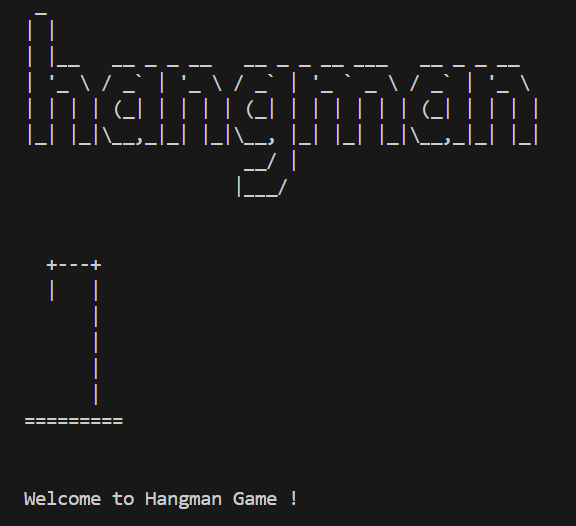

# HANGMAN GAME

Hangman game coded in Python. Feel free to test it out !

## Features

- **Easy Setup**: Run the included batch file to start playing.
- **Random Words**: A variety of ranging from 5 to 9 characters.
- **Visual Feedback**: Visual representation of the hangman stages with ASCII art.
- **Restart Option**: Restart the game without rerunning the script.

## How to Play

1. **Download the Game Folder**: Clone or download the repository.
2. **Run the Game**: Double-click the `Play_Hangman_File.bat` to open the game in your terminal.
3. **Guess the Word**: Follow the on-screen instructions to guess letters and reveal the hidden word. Each wrong letter brings you closer to the hangman's fate!
4. **Enjoy**: Have fun guessing and improving your vocabulary. When the game ends, choose to restart or exit.

## Example Gameplay

# Game FlowChart

